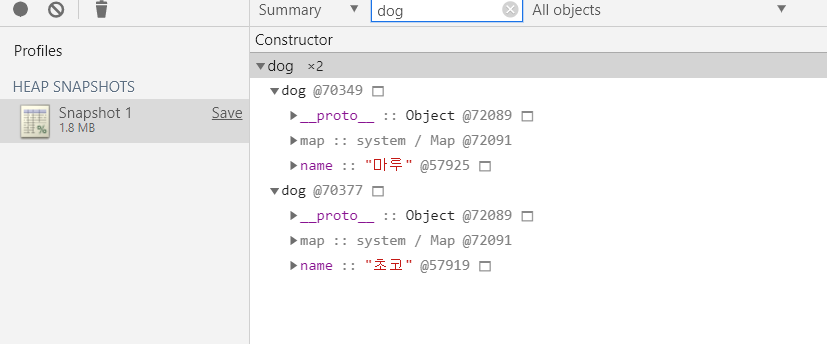
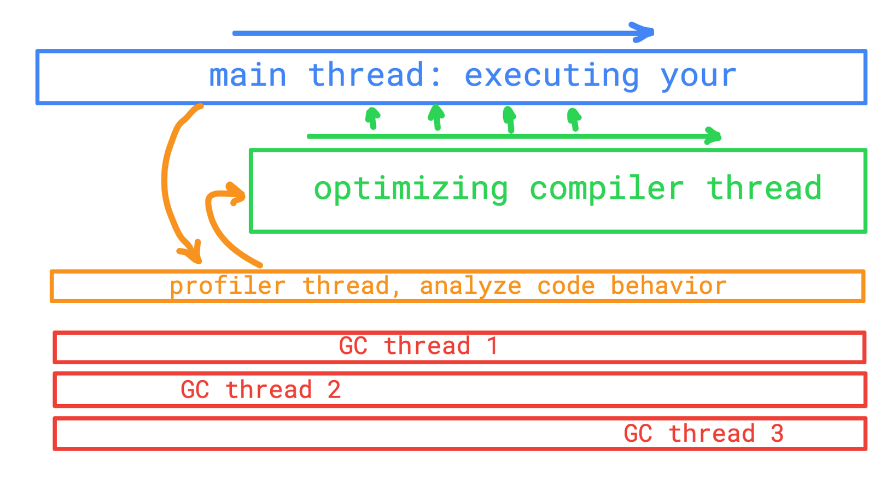

## javascript V8 엔진이란
V8 엔진은 구글이 만들었으며, C++로 제작됩니다. 구글 크롬과 nodejs 런타임에서도 사용되고 있습니다.

## V8 엔진 탄생배경
웹 브라우저 내부에서 자바스크립트의 수행속도 개선을 목표로 고안되었습니다. 속도향상을 위해 인터프린터를 사용하는 대신 자바스크립트를 더 효율적인 머신코드로 번역합니다. **저스트인타임** 컴파일러를 구현함으로써 코드 실행시에 자바스크립트 코드를 머신코드로 변환해줍니다.

## 히든클레스
자바스크립트는 프로토타입 기반의 언어입니다. 클레스 라는것이 없으며 객체를 복사하는 과정에서 생성됩니다
자바스크립트는 동적언어기 때문에 객체가 생성된 이후 속성을 쉽게 추가, 삭제 가능합니다

대부분의 자바스크립트 인터프린터가 딕셔너리와 유사한구조(해쉬함수 기반)를 이용해 객체속성값을 메모리에 저장합니다

* 딕셔너리: 자료구조의 하나로, 키 하나와 값 하나가 연관되어 있으며 키를 통해 연관되는 값을 얻음
* 해쉬함수: 해시 함수는 임의의 길이의 데이터를 고정된 길이의 데이터로 매핑하는 함수

이러한 구조덕에 자바스크립트 객체 속성값을 가져오는것은 자바나 c# 보다 비싼 행동이 됩니다
자바는 모든 객체속성이 컴파일 전에 고정된 객체 레이아웃을 통해 결정됨 런타임에 동적으로 추가가 불가능하니 속성값(혹은 속성을 가르키고 있는 포인터)는 메모리에 고정된 오프셋을 가진 연속적인 버퍼로 저장이 가능하고 오프셋의 길이는 속성 타입에 따라 쉽게 결정이 가능 하지만 이런 속성들이 동적으로 변하는 자바스크립트에선 불가능합니다

딕셔너리를 이용하여 메모리상의 객체 속성의 위치를 찾아내는것은 비효율적입니다
v8은 히든클레스 히든클레스는 자바에서 사용되는 고정객체 레이아웃과 유사하게 작동되는데 런타임에서 생성된다는 차이점이 존재합니다

```javascript
function point(x, y) {
    this.x = x;
    this.y = y;
}
new point(1, 2);
```
new pooint(1, 2)를 하면 히든클래스 C0 가 생성됩니다.
point에는 아직 아무 속성도 없으므로 C0는 비어있습니다.
this.x = x 수행되면 C0를 기반으로 C1이라는 두번째 히든클레스가 생성됩니다
C1은 x속성을 찾을수 있는 메모리상의 위치(point의 상대적)에 대한 설명이 포함되 있습니다.
위 예제의 경우 x는 오프셋0에 저장되며, 이는 연속된 버퍼로서 해당 메모리의 포인트 객체를 읽을 때 첫번째 오프셋이 x속성에 대응 합니다.
V8은 또한 클레스전환으로 업데이트를 하게됨 만약 x 속성이 추가되면 히든클래스 C0 에서 C1으로 변경되라는 내용이 추가되며 포인트 객체는 C1이 됩니다.

this.y 도 마찬가지로 작동됩니다.

히든클레스는 연속된 버퍼에 오프셋으로 저장하므로 실행하는 순서에 따라 히든클레스가 바뀝니다.

## 히든 클래스 확인법
```javascript
function dog(name) {
    this.name = name;
}

var foo = new dog('초코');
var bar = new dog('마루');
```


1. chrome 개발자 도구 > Memory 탭에 들어간다.
2. Profiles에 Take snapshot을 누른다.
3. 검색에 자신이 만든 dog을 검색한다.

위 그림을 보면 두개의 히든 클래스 즉 Map이 동일한 것을 확일할 수 있습니다.

## V8 인라인 캐싱
V8엔진은 자주 호출되는 함수를 최적화 함으로써 코드의 실행시간을 낮추려고 노력합니다. 실제 최적화는 함수 호출의 프로파일링과 요구되는 인자유형 수집을 통해 이뤄집니다. 만약 전달되는 객체의 히든클레스가 같다면 해당속성의 메모리 호출을 캐싱합니다.

#### 인라인 캐싱 예제
```javascript
function foo(a, b) {
    this.a = a;
    this.b = b;
}

function printFoo(f) {
    f.a
    f.b
}

const a = new foo(1, 2);
const b = new foo(1);
const c = new foo();

printFoo(a);
printFoo(b);
printFoo(c);
```
위 a, b, c 상수는 모두 같은 히든클레스 입니다. 그리고 printFoo를 자주 호출합니다. 그러면 V8엔진은 자주 호출되는지 의심대는 함수들은 함수에 의해 갱신되는 profilng 정보를 추출합니다. 만약 함수가 자주호출된다면 코드 실행은 최적화로 전환됩니다. 최적화는 다른 컴파일러에서 실행되면 최적화된 기계어를 생성하고 실행 컨텍스트를 갱신합니다. 만약 자주 호출되는 코드가 아니라 판단한다면, 행동을 분석합니다.


## V8 컴파일러
2개의 다른 컴파일러를 사용합니다. 함수 호출 시 자주사용하는 함수인지 확인합니다.

만약의 자주사용되는 함수가 아니라 판단된다면 행동을 분석해 다음 함수 호출시 자주 사용되는 함수인지 체크합니다 그리고 **ignition**를 사용하여 빠르고 간단하게 스크립트 실행을 도와줍니다. 자주 사용되는 함수라면 **TurboFan**으로 최적화를 진행하고 저장합니다

## 쓰레드 처리

먼저 코드를 가능한 빨리 실행하려는 메인쓰레드가 있습니다. **가능한 빨리** 라는 말은 코드를 해석하는 시간입니다. 메인쓰레드는 기계어를 생성하고 실행시킵니다. 그림에서 main 쓰레드말고 최적화된 컴파일 쓰레드가 있습니다. profile, garbage collector 쓰레드도 추가하였습니다. 메인쓰레드는 실행되는 우리의 코드를 해석하고 실행도중에 최적화 컴파일러는 코드의 자주 호출되는 부분을 최적화 된 기계어로 대체합니다. 프로파일러 쓰레드는 코드를 분석하여 최적화할 소스를 분석해줍니다. 

## 내부 최적화 코드 작성법
성능이 좋은 자바스크립트 프로그램을 만들고 싶다면, 자바스크립트를 정적인 언어라고 생각하고 쓰는 것이 좋습니다. 동적인 특성들을 최대한 활용하여 멋지고 파워풀한 코드를 작성할 수도 있지만, 거기엔 항상 성능이라는 대가가 따른다는 것을 명심해야 합니다.


## 출처
[자바스크립트는 어떻게 작동하는가: V8 엔진의 내부 + 최적화된 코드를 작성을 위한 다섯 가지 팁](https://engineering.huiseoul.com/%EC%9E%90%EB%B0%94%EC%8A%A4%ED%81%AC%EB%A6%BD%ED%8A%B8%EB%8A%94-%EC%96%B4%EB%96%BB%EA%B2%8C-%EC%9E%91%EB%8F%99%ED%95%98%EB%8A%94%EA%B0%80-v8-%EC%97%94%EC%A7%84%EC%9D%98-%EB%82%B4%EB%B6%80-%EC%B5%9C%EC%A0%81%ED%99%94%EB%90%9C-%EC%BD%94%EB%93%9C%EB%A5%BC-%EC%9E%91%EC%84%B1%EC%9D%84-%EC%9C%84%ED%95%9C-%EB%8B%A4%EC%84%AF-%EA%B0%80%EC%A7%80-%ED%8C%81-6c6f9832c1d9)

[V8의 히든 클래스 이야기](https://engineering.linecorp.com/ko/blog/v8-hidden-class/)

[Node.js V8 내부 : 예시적 지침서](https://medium.com/sjk5766/%EB%B2%88%EC%97%AD-node-js-v8-%EB%82%B4%EB%B6%80-%EC%98%88%EC%8B%9C%EC%A0%81-%EC%A7%80%EC%B9%A8%EC%84%9C-326e57f9727e)